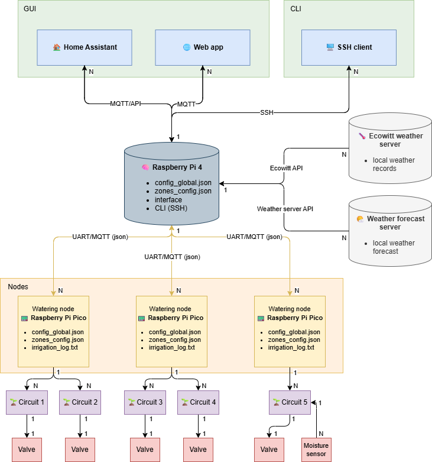

# Smart Irrigation System

**A distributed IoT platform for automated garden irrigation**, designed for Raspberry Pi–based edge nodes coordinated by a central server and web dashboard.  
The project demonstrates a fully functional **prototype** of a irrigation network with weather-based logic, MQTT communication, and modular architecture.

> Project is currently in *Phase 3 (v0.9)* - fundamental node and server functionality is complete, basic web UI prototype is implemented. Demo is available for local testing.

---

## Overview 

**Architecture Layers**
1. **User Layer** – Web Dashboard (implemented in React), Home Assistant integration (planned), or CLI.
2. **Central Server** – Main coordinator handling multiple irrigation nodes via MQTT, configuration & data hub, REST API provider. Runs on Raspberry Pi 4/5 or PC.
3. **Irrigation Nodes** – autonomous controllers managing valves and sensors, fail-safe operation. Runs on Raspberry Pi Zero 2 W.

The Smart Irrigation System uses **edge computing** to manage watering zones autonomously. In case of network failure, each node continues to operate based on local data, schedules, weather conditions and configuration. 
Each **node** controls multiple irrigation circuits, while a **central server** coordinates and monitors the network through MQTT and a REST API.

---

## Feature Highlights

### Intelligent Irrigation Control
- Multi-zone management (parallel or sequential modes)
- Zone-specific configuration:weather conditions sensivity, dripper/soaker hose/sprinkler modes, custom schedules, ...
- Weather-adaptive watering using live or simulated weather data
- Automatic daily scheduling
- Manual start/stop
- Precise water calculation per zone (uniform or dripper-based mode)
- Maximum-flow monitoring to prevent pressure drops & automatic staggering of zones

### Reliability and Safety
- **Fail-safe design:** valves are *normally closed* and always close on crash or power loss
- **Thread-safe control:** each circuit runs in an isolated thread with monitored state
- **State recovery:** nodes store states and logs them in data file to recover after unclean shutdowns
- **Local fallback:** nodes continue operating without server connectivity
- **Verbose logging:** detailed local logging at multiple levels for debugging and audit trails + cental collection (planned)

### Security and Robustness
- MQTT communication prepared for TLS support (planned v1.1+)
- Clear separation of configuration, runtime data, and credentials
- Validation and filtering of weather anomalies
- Modular, testable Python codebase with separation of concerns

---

## Components & Technologies used

| Layer | Technology | Description |
|-------|-------------|-------------|
| **Edge Node** | Python 3.10, threading, RPi.GPIO, Paho-MQTT | Local control of irrigation zones |
| **Server** | FastAPI, Paho-MQTT, JSON, threading | Central coordination & API backend |
| **Web UI** | React (Vite), Axios, REST API | Dashboard for control & monitoring |
| **Communication** | MQTT (Paho-MQTT) over TCP (TLS planned) | Node ↔ Server messaging and command handling |
| **Deployment** | Raspberry Pi Zero 2 W (Node), Raspberry Pi 4/5 (Server) | Hardware platform |

---

## Quick Start (Local Demo)

You can test the full **Node ↔ Server ↔ Web UI** chain on a single computer using a local Mosquitto MQTT broker.

Full instructions are in the [SETUP_AND_RUN_DEMO.md](docs/SETUP_AND_RUN_DEMO.md) file.

---

## Roadmap

| Phase | Version | Status | Focus |
|-------|---------|--------|-------|
| 1     | v0.6    | Completed | **Node MVP**: autonomous irrigation logic, MQTT communication, configuration & logging |
| 2     | v0.8    | Completed | **Server prototype**: MQTT communication with single demo node, REST API |
| **3**     | **v0.9**    | **Completed** | **Web UI prototype**: basic dashboard for manual control and monitoring (React), REST integration |
| 4     | v1.0    | *Planned* | **Full architecture MVP**: multi-node support, server-side configuration, log collection, Web UI enhancements |
| 5     | v1.1+   | *Planned* | Stability improvements, refactoring node codebase, security enhancements (TLS, OAuth, credential management) |

---

## Documentation

Full documentation is available in the [docs/](docs/) folder, including:
- [User Guide](docs/user_guide/) – Installation and setup (local all-in-one demo, server, node)
- [Developer Reference](docs/DEVELOPER_REFERENCE.md/) – Architecture, code structure
- [Architecture Overview](docs/ARCHITECTURE_OVERVIEW.md)
- [Features & Configuration](docs/overview/FEATURES_AND_CONFIGURATION.md)

---

## License

This project is licensed under the [MIT License](./LICENSE) © 2025 Lukáš Soják.

