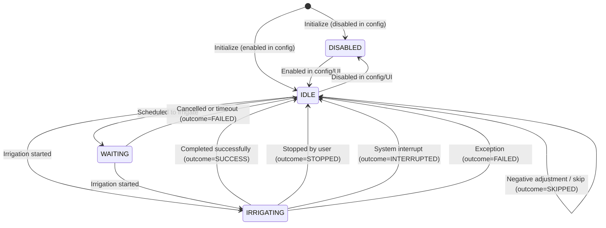

# Irrigation Circuit – State Machine Overview

This document describes the runtime state machine of a single irrigation circuit in the Smart Irrigation System.  
It defines:

- **IrrigationState** — the current state of a circuit
- **IrrigationOutcome** — the result of the last irrigation attempt
- All valid state transitions
- Scheduling behavior (**WAITING** state)
- Behavior during errors, user actions, or system interruptions

The design follows a clean separation of concerns:

| Aspect                                 | Representation                                      |
|----------------------------------------|-----------------------------------------------------|
| What is happening now                  | `IrrigationState`                                   |
| What happened last time                | `IrrigationOutcome`                                 |
| Full metadata about one irrigation run | `IrrigationResult`                                  |

This architecture is stable, deterministic, thread-safe, and easy to use from the server, UI, and MQTT layers.

---

## IrrigationState (runtime)

These states represent the current, real-time status of an irrigation circuit.

```python
class IrrigationState(Enum):
    IDLE = "idle"            # Circuit is ready and not irrigating
    WAITING = "waiting"      # Circuit is queued by the scheduler (flow/sequencing)
    IRRIGATING = "irrigating" # Circuit is actively irrigating
    DISABLED = "disabled"    # Circuit is disabled by configuration or UI
```

*Notes:*
- **IDLE**: is the default state after boot (if the circuit is enabled in config) and after each completed irrigation.
- **WAITING**: is used when the circuit is scheduled to irrigate but is waiting for other circuits to finish (e.g., in sequential mode or due to flow constraints).
- **IRRIGATING**: is the active state during irrigation.
- **DISABLED**: is set when the circuit is turned off in the configuration or UI. No irrigation can occur in this state.

---

## IrrigationOutcome (last result)
Represents the result of the last irrigation attempt.

```python
class IrrigationOutcome(Enum):
    SUCCESS = "success"
    FAILED = "failed"
    STOPPED = "stopped"
    INTERRUPTED = "interrupted"
    SKIPPED = "skipped"
```

Key principles:
 - **outcome** is not reset when the circuit goes back to IDLE. It reflects the last known irrigation attempt.
 - On boot, **outcome** is initialized using the persistent state file. If the state file is missing or corrupted, the **outcome** defaults to `None` until the first result is produced.
 - Full metadata about each irrigation run is stored in `IrrigationResult` objects in the log file.

 ---

 ## IrrigationResult (full run metadata)
 Each irrigation attempt produces an `IrrigationResult` object that captures all relevant data:
- circuit_id: int
- success: bool
- outcome: IrrigationOutcome
- start_time: datetime
- completed_duration: int
- target_duration: int
- actual_water_amount: float
- target_water_amount: float
- error: Optional[str]

This is persisted via `CircuitStateManager` to `irrigation_log.json` for historical analysis.

## Allowed State Transitions
This table defines all valid transitions between `IrrigationState` values:

| Previous State        | Event / Trigger          | New State        | Outcome              |
|-----------------------|--------------------------|------------------|----------------------|
| DISABLED              | Enabled in config/UI     | IDLE             |                      |
| IDLE                  | Disabled in config/UI    | DISABLED         |                      |
| IDLE                  | Irrigation started       | IRRIGATING       |                      |
| IDLE                  | Scheduled to irrigate    | WAITING          |                      |
| IDLE                  | Negative adjustment      | IDLE             | SKIPPED              | 
| WAITING               | Irrigation started       | IRRIGATING       |                      |
| WAITING               | Cancelled or timeout     | IDLE             | FAILED               |
| IRRIGATING            | Completed successfully   | IDLE             | SUCCESS              |
| IRRIGATING            | Stopped by user          | IDLE             | STOPPED              |
| IRRIGATING            | System interrupt         | IDLE             | INTERRUPTED          |
| IRRIGATING            | Exception                | IDLE             | FAILED               |

Additional outcomes may be added in the future as needed.

---

## State diagram (Mermaid)



---