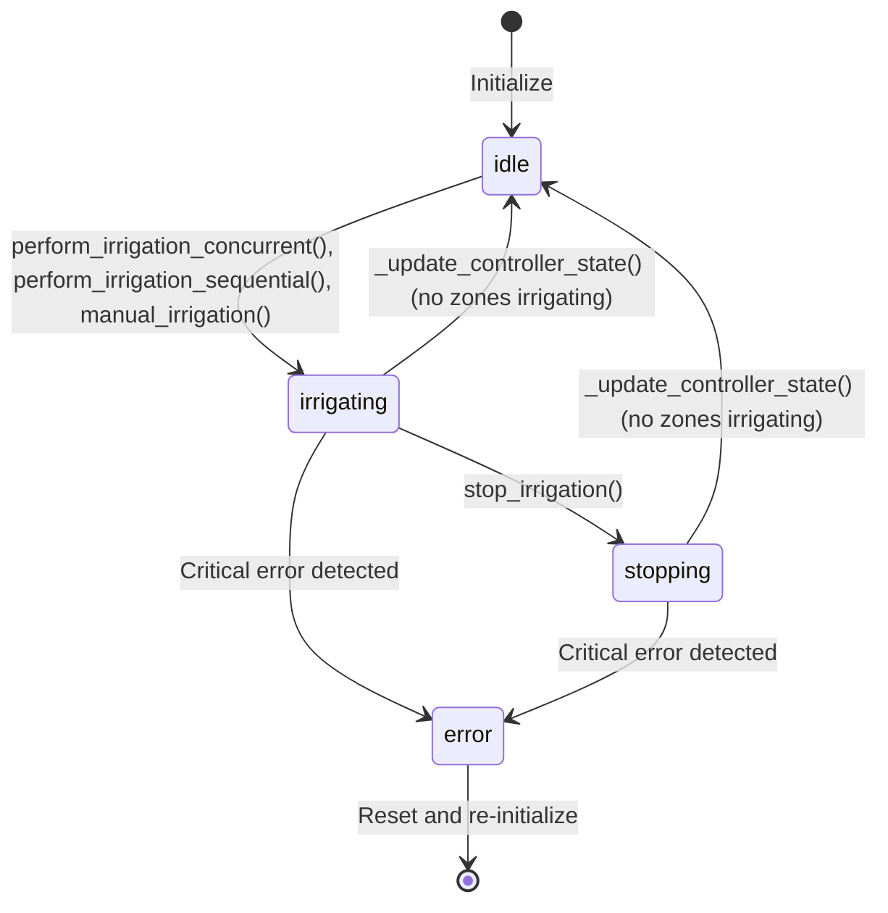

# IrrigationController – State Machine Documentation

## Overview

This file describes the internal state machine of the [`IrrigationController`](../smart_irrigation_system/irrigation_controller.py) singleton class, which manages the irrigation process lifecycle.

---

## States

The states are defined in the [`ControllerState`](../smart_irrigation_system/enums.py) enum.

The `IrrigationController` can be in one of the following states:
- `idle`: The controller is not currently irrigating any zones and is waiting for the next scheduled irrigation or a manual task.
- `irrigating`: The controller is actively irrigating one or more zones (could be either automatic or manual irrigation or a combination).
- `stopping`: The controller is in the process of stopping irrigation due to a manual stop command or an error condition. The `stop_event` is set, but all zones have not yet been fully stopped.
- `error`: The controller has encountered an error that prevents it from continuing normal operation. This could be due to hardware failures, communication issues, or other critical problems.

## State Transitions

The state transitions are triggered by specific events or conditions. The following transitions are defined:

- `idle` -> `irrigating`: Triggered when a scheduled irrigation time is reached or a manual start command is issued.
    - Triggered by `perform_irrigation_concurrent()`, `perform_irrigation_sequential()`, or `manual_irrigation()` method calls.

- `irrigating` -> `idle`: Triggered when there are no more zones currently being irrigated, and no critical errors occurred.
    - Triggered by `_update_controller_state()` method call when no zones are currently irrigating.

- `irrigating` -> `stopping`: Triggered when a manual stop command is issued or an error condition is detected during irrigation which triggers the stop process.
    - Triggered by `stop_irrigation()` method call.

- `stopping` -> `idle`: Triggered when all zones have been successfully stopped and no critical errors occurred.
    - Triggered by `_update_controller_state()` method call when no zones are currently irrigating.

- `irrigating`, `stopping` -> `error`: Triggered when a critical error is detected that prevents controller operation.
    - Triggered by error handling mechanisms within the controller.

- `error` -> `idle`: This transition is not possible in the current version. The controller must be reset and initialized again to recover from an error state. Automatic recovery is not implemented.

## State Diagram (Mermaid)

## Notes

- All the transitions are managed internally by the `IrrigationController`'s method `_update_controller_state()`, which checks the current conditions and updates the state accordingly. This method is called periodically and after significant events such as starting or stopping irrigation to ensure the state is always accurate.
- The `stopping` state is a transient state that indicates the controller is in the process of stopping irrigation. Once all zones are confirmed to be stopped, the controller transitions back to `idle`.
- Future extensions: MQTT/state notifications, persistence layer integration.