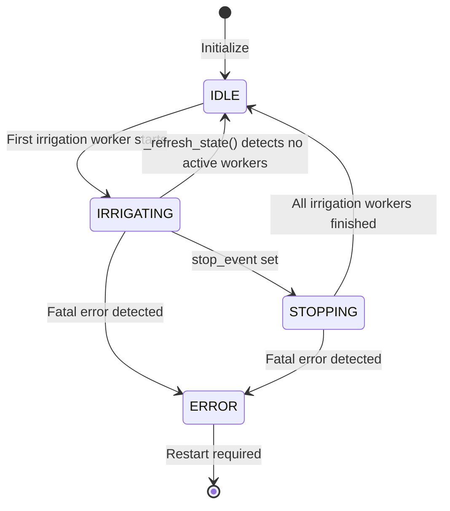

# ControllerCore – State Machine Documentation

## Overview

This file describes the internal state machine of the [`ControllerCore`](../../smart_irrigation_system/node/core/controller/controller_core.py) module, which is the central node controller.

---

## States

The uses the [`ControllerState`](../../smart_irrigation_system/node/core/enums.py) enum with the states below. The states are derived dynamically from the activity of irrigation workers in `ThreadManager` and the status of the `IrrigationExecutor`.

The `ControllerCore` can be in one of the following states:
- `IDLE`: The controller is not currently irrigating any zones and is waiting for the next scheduled irrigation or a manual task.
- `IRRIGATING`: At least one IRRIGATION worker is active. This includes both:
  - automatic irrigation tasks started by the executor,
  - manual irrigation tasks started via CLI/MQTT.
- `STOPPING`:  A stop request has been issued (`stop_event` set), and one or more irrigation
  workers are still shutting down. The controller enters this state until all
  workers terminate.
- `ERROR`: The controller has encountered an error that prevents it from continuing normal operation.

---

## State Transitions

The state transitions are triggered by specific events or conditions. The following transitions are defined:

- `IDLE` -> `IRRIGATING`: Triggered when the first irrigation worker starts.
  - Caused by automatic cycle execution (`start_auto_cycle`)
  - Caused by parallel or single-zone manual irrigation

- `IRRIGATING` -> `IDLE`: Triggered when all IRRIGATION workers have finished and no errors occurred.

- `IRRIGATING` -> `STOPPING`: Triggered when:
  - `stop_all_irrigation()` is invoked, or
  - executor detects a fatal condition and sets the stop event.

- `STOPPING` -> `IDLE`: Triggered when all zones have been successfully stopped and no critical ERRORs occurred.
    - Triggered by `_update_controller_state()` method call when no zones are currently IRRIGATING.

- `IRRIGATING`, `STOPPING` -> `ERROR`: Triggered when executor lifecycle callbacks report a failure that prevents 
continued operation (e.g. hardware errors, uncaught exceptions).

- `ERROR` -> `IDLE`: This transition is not possible in the current version. The controller must be reset and initialized again to recover from an ERROR state. Automatic recovery is not implemented.

*All transitions are resolved by `_refresh_state()`, which calculates the new state based strictly on active workers and stop event flags.*

## State Diagram (Mermaid)

## Notes

- `_refresh_state()` is invoked after key executor events and also periodically (every 5 seconds) as a safety mechanism to ensure state consistency even if a callback is missed.
- The `STOPPING` state is a transient state that indicates the controller is in the process of STOPPING irrigation. Once all zones are confirmed to be stopped, the controller transitions back to `IDLE`.
- The `ERROR` state isolates the system from further execution until restart.
- Future extensions: MQTT/state notifications, persistence layer integration.