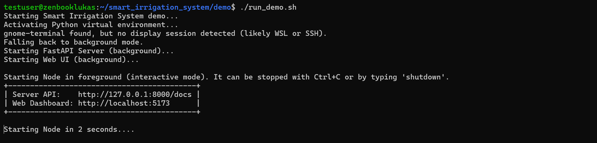

# Smart Irrigation System – Local All-in-One Demo Setup  
**Applies to:** Smart Irrigation System v0.9+ (Node + Server + Web UI prototype)  

This guide explains how to **run the full Smart Irrigation System demo locally on a single computer**,  
including all three layers – **Node**, **Server**, and **Web UI** – without any external hardware.

The demo allows you to test the complete architecture and observe MQTT communication and REST API integration in action.

---

## Overview
In this demo:
- All three layers (Node, Server, Web UI) run on your PC.  
- Communication is handled locally using a **Mosquitto MQTT broker**.
- The demo simulates an irrigation node, the central server, and a simple dashboard as a prototype of the Web UI.

**Architecture (local setup):**

```
[Node (simulated)] <--> MQTT <--> [Server (local)] <--> REST API <--> [Web UI (local)]
```

---

## Prerequisites

### System Requirements
- **Python** ≥ 3.10  
- **Node.js** ≥ 18 (LTS)  
- **Mosquitto MQTT Broker**  
- **Git**

---

## Simplified Installation (Recommended)

The easiest way to install and run the full demo is using the prepared shell scripts.

### 1️⃣ Install all dependencies
```bash
cd demo
chmod +x install_demo.sh run_demo.sh    # Make scripts executable
./install_demo.sh
```

This script will:
- Create a Python virtual environment (`venv`)
- Install all required Python dependencies (for Server and Node simulation) from `requirements_demo.txt`
- Install all Web UI dependencies via `npm install`

### 2️⃣ Run the demo
```bash
./run_demo.sh
```

This script will:
- Start a local Mosquitto MQTT broker (if not already running)
- Launch the simulated Node, Server, and Web UI
- Each component opens in a separate terminal window (if GUI terminal is not available, or you are using SSH/WSL, it will run server and web UI in the background while Node runs in the current terminal)



### 3️⃣ Access the Web UI
After running the demo, open your web browser and visit url:
```
http://localhost:5173
```

**You should see the Smart Irrigation System dashboard displaying simulated data.**
*If the UI does not load, check the terminal window to see logs with the actual URL provided by Vite.*

<figure style="text-align: center;">
  
  <figcaption>Web Dashboard Prototype (v0.9)</figcaption>
</figure>

---

## Manual Installation
If you prefer to set up each component manually, follow the steps below.

### 1️⃣ Create Python Virtual Environment
```bash
cd demo
python3 -m venv venv
source venv/bin/activate  # On Windows use `venv\Scripts\activate`
```

### 2️⃣ Install Python Dependencies
Install all required Python packages for Node and Server:
```bash
pip install -r requirements_demo.txt
```

*This combines both `node/requirements.txt` and `server/requirements.txt`.*

### 3️⃣ Install Web UI Dependencies
```bash
cd ../web_ui
npm install
cd ../demo
```

### 4️⃣ Start Mosquitto MQTT Broker
Make sure Mosquitto is installed and running:
```bash
sudo service mosquitto start
```
or to run it manually:
```bash
mosquitto -v
```

*Default configuration uses localhost:1883.*

### 5️⃣ Run the Server
In one terminal, start the Server:
```bash
source venv/bin/activate  # Activate the virtual environment
python -m smart_irrigation_system.server.main
```
*Check the API is available at* `http://localhost:8000/docs`.

### 6️⃣ Run the Simulated Node
In another terminal, start the simulated Node:
```bash
source venv/bin/activate  # Activate the virtual environment
python -m smart_irrigation_system.node.main
```
*You should see Node debug CLI running.*

### 7️⃣ Run the Web UI
In a third terminal, start the Web UI:
```bash
cd ../web_ui
npm run dev
```
Once running, visit the localhost URL provided in the terminal by Vite, typically:

```
http://localhost:5173
```

**You should see the Smart Irrigation System dashboard displaying simulated data.**

---

## Verify the Setup

Once all components are running:

| Component        | Expected Behavior                                                  |
|------------------|--------------------------------------------------------------------|
| Simulated Node   | Publishes status messages to MQTT, responds to commands.           |
| Server           | Receives MQTT messages, exposes REST API.                          |
| Web UI           | Displays connected nodes, their status, allows irrigation control. |

You can trigger irrigation actions via the Web UI and observe the Node responding accordingly in its CLI:
**- Start irrigation** → Sends `/start_irrigation` request to Node.
**- Stop irrigation** → Sends `/stop_irrigation` request to Node.
**- Refresh status** → fetches `/nodes` via REST.

> In current implementation, the Web UI polls the fresh status every 3 seconds. The server updates the Node status cache every 10 seconds. Maximum delay for status updates is around 13 seconds.

---

## Troubleshooting
- **MQTT Connection Issues**: Ensure Mosquitto is running and accessible at `localhost:1883`.
- **Port Conflicts**: Make sure ports `8000` (Server) and `5173` (Web UI) are free.
- **Dependency Errors**: Verify all dependencies are installed correctly in the virtual environment and Web UI.
- **Permission Errors**: If you encounter `PermissionError` when starting the Node or Server (for example when logging to `/runtime/.../logs/`),
make sure the project directory is owned by your current user:

```bash
sudo chown -R $(whoami):$(whoami) .
```
- **Web UI Not Loading**: The port provided by Vite may differ than `5173`.
  - Simplified installation: Check the output of `run_demo.sh` for the logs location to find the output of Vite with the correct port and URL.
  - Manual installation: Check the terminal output running the Vite server for the correct port and URL.
